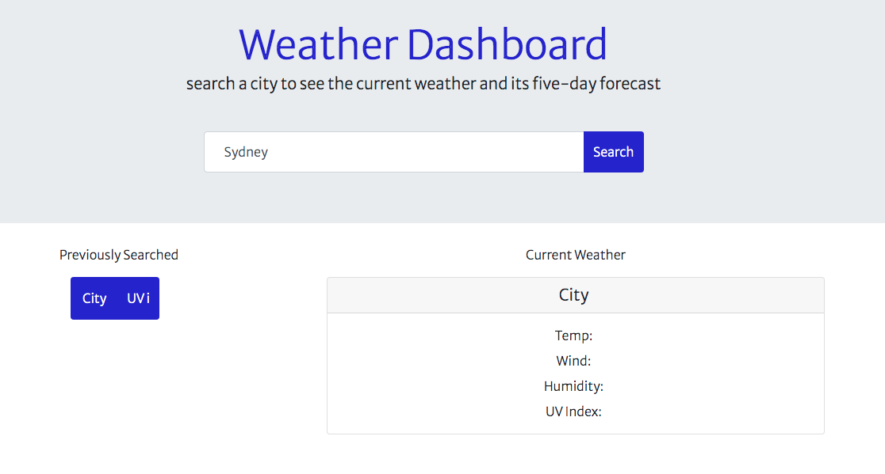
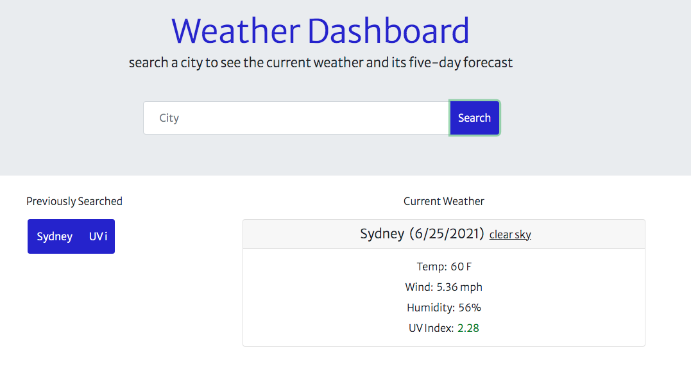
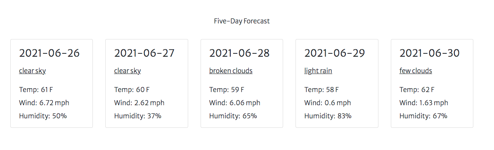
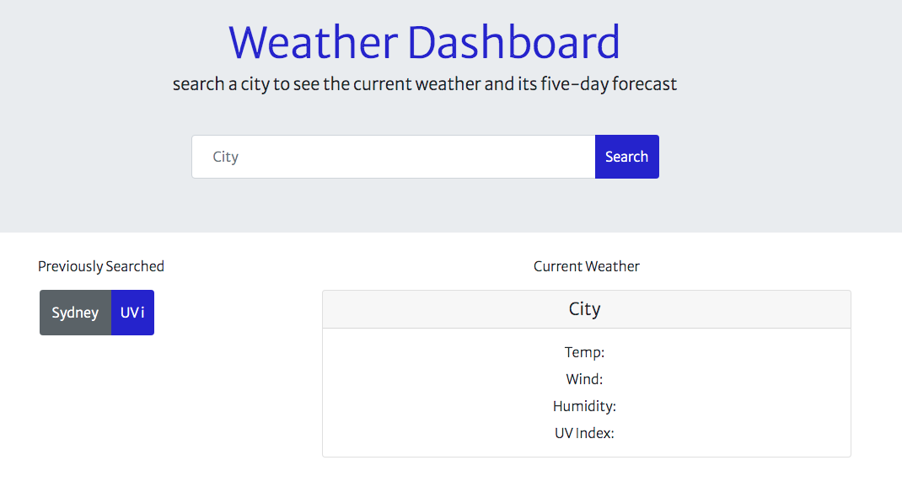
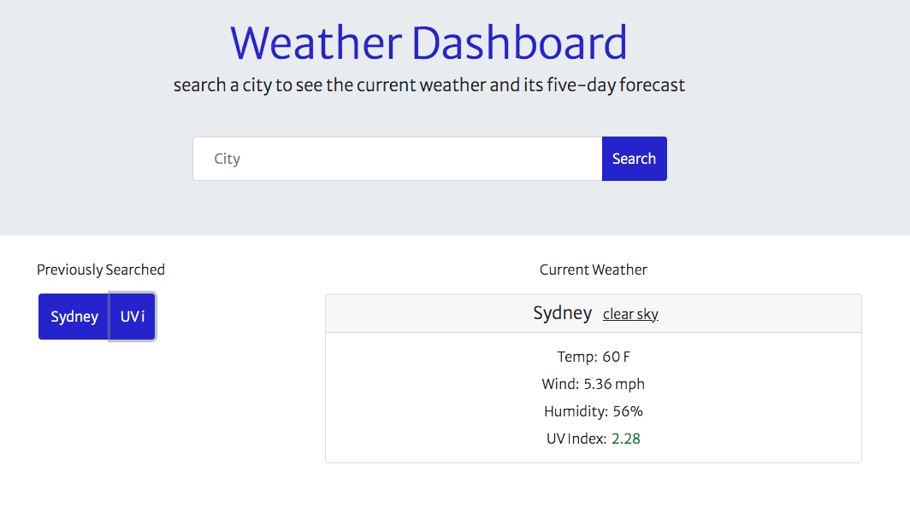

# hw6-weather-dashboard

Summary:
 
The objective of this application is to allow the user to search for any city in the world and see its current weather and five-day forecast. Principles of HTML, CSS, Javascript, Moment.js, and API (OpenWeather) calls were employed. For best results, please render using Chrome. Future development would include: re-rendering the five-day forecast, displaying weather icons, and adding additional methods to render previously searched cities. 

 

Breakdown:
 
Upon loading the page the user can type in any city into an input field and see its current weather and five-day forecast. At page reload the five day forecast is hidden to make a more intuitive user experience. Weather data provided includes: current calendar day, overcast status, temperature, wind speed, humidity, and UV index. If the user accidentally refreshes the page, he/she can re-render the previously searched city using the city and UV index buttons. 

 

Application URL: 
 
Check out the deployed application here: https://tedheikkila.github.io/hw6-weather-dashboard/
 

 
Screenshots:
 

